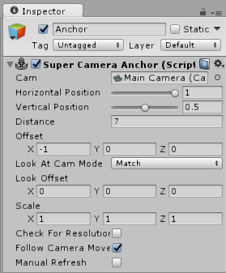

<pre>
<head>
	<title>Super Camera Anchor Documentation</title>
	<link rel="shortcut icon" type="image/png" href="/SCADocImages/favicon.png"/>
</head>
</pre>
 
 
 
<article class="column"><article class="banner">
 
 
Super Camera Anchor Documentation - v1.1
</article><article class="tableofcontents"><article class="textarea">
#Table of Contents

[Features](#Features)

1. [Adding Super Camera Anchor to Unity](#Adding Super Camera Anchor to Unity)
	* [Importing Super Camera Anchor into Unity](#Importing Super Camera Anchor into Unity)
	* [Adding Super Camera Anchor to a Scene](#Adding Super Camera Anchor to a Scene)
2. [Getting Started](#Getting Started)
	* [Tips & Tricks](#Tips & Tricks)
3. [Functions & Variables](#Functions & Variables)
	* [Public Functions](#Public Functions)
	* [Public Variables](#Public Variables)

[Notes](#Notes)
[ChangeLog](#ChangeLog)
[Credits](#Credits)
</article></article><article class="textarea">

***

#Features
* Super Camera Anchor is a Unity tool meant to replace Unity UI. It can be used to pin 3D objects or sprites to a camera, doing exactly what Unity UI does but with more freedom.

***

#1. Adding Super Camera Anchor to Unity

##a. Importing Super Camera Anchor into Unity 

To import Super Camera Anchor into your project, either drag in the .unitypackage file, or get it from the asset store window.

###Imported folders, what they do, and if you need to import them or not, alphabetically:

* __"Documentation"__ contains these docs! You don't need to import them, but you probably should!
* __"Example"__ contains the demo scene. Not needed if you don't want the demo.

The rest of the files are required.
Anchor.obj is used as a gizmo, Icon.png is the script's icon, and SuperCameraAnchor.cs is the actual code!

##b. Adding Super Camera Anchor to a Scene

To add Super Camera Anchor to an object, select "Add Component" in the inspector of an existing object. It can be found under "Utility > Super Camera Anchor".

***

#2. Getting Started

##a. Tips & Tricks

* Mimicking Unity UI
	You can use camera culling masks to make it so UI is drawn on top of everything else, seperate from your scene. First, create a new camera to be used as your UI camera, and set the culling mask to only see the "UI" layer. Next, on your game's main camera, set it to ignore the "UI" layer. Finally, on each anchor set the Layer to be "UI", and the "cam" variable to the new UI camera.

<article class="rightbox">
  
The inspector window.
</article>

***

#3. Functions & Variables

##a. Public Functions

* ###void SuperCameraAnchor.Refresh()
	Forces Super Camera Anchor to update. For setting resolution manually.

* ###[STATIC] void SuperCameraAnchor.RefreshAll()
	Calls Refresh() on every Super Camera Anchor in the scene. Should only be called when loading a scene, or when player changes resolution, as it uses FindGameobjectsOfType(), which is intensive.

##b. Public Variables

* ###[READ ONLY] Transform SuperCameraAnchor.t
	A quick reference to the transform on this object.

* ###bool SuperCameraAnchor.checkForResolutionChange
	Controls whether the anchor will automatically check to see if the resolution has changed in play mode or not.

* ###bool SuperCameraAnchor.followCameraMovement
	Controls if the object will follow the camera when it moves/rotates. This bool isn't used if the anchor is a child of the camera.

* ###Camera SuperCameraAnchor.cam
	The camera the anchor is being pinned to.

* ###float SuperCameraAnchor.horizontalPosition
	Horizontal position of the object, in viewport space. (Ranged 0 to 1)

* ###float SuperCameraAnchor.verticalPosition
	Vertical position of the object, in viewport space. (Ranged 0 to 1)

* ###Vector3 SuperCameraAnchor.offset
	In world space, an offset from the horizontal/vertical position's anchor.

* ###float SuperCameraAnchor.distance
	The distance the anchor will be from the camera.

* ###SuperTextMesh.LookAtCamMode SuperTextMesh.lookAtCamMode
	The way the anchor will rotate, relative to the camera.

	* LookAtCamMode.Match - Match rotation with the camera.
	* LookAtCamMode.Stare - Face towards the camera.
	* LookAtCamMode.None - Don't do any rotation changes.

* ###Vector3 SuperTextMesh.lookOffset
	If lookAtCamMode is Match or Stare, this will control a rotational offset with euler angles. (t.rotation is used and shown in the inspector if lookAtCamMode is set to None)

***

#Notes
* Adding Super Camera Anchor to an object replaces its transform, but the transform is still there to reference in other scripts. You can quickly access this with "SuperCameraAnchor.t".
* If a prefab has a Super Camera Anchor component on it, it cannot remember which camera it was linked to. Whenever the camera isn't set (including when Super Camera Anchor is first added to a scene), it will prioritize find a camera in this order: Camera in parent > main camera > any camera.

##Known Bugs
* None at the moment!

##Planned Features / To Do List:
* Scaling options, similar to Unity UI.

***

#ChangeLog
###v1.0
* Initial release!

###v1.0.1
* Compiles properly now.

###v1.0.2
* Having a prefab with Super Camera Anchor on it will no longer crash when loading a new scene.
* Parent camera is prioritized over main camera when finding a camera, now.

###v1.1
* Removed manual refresh, as it was causing issues with Unity 2017.1

***

#Credits
Coding and design by Kai Clavier ([@KaiClavier](http://twitter.com/KaiClavier))  
Extra CSS help by Tak ([@takorii](http://twitter.com/takorii))  
 
 
</article>
</article>